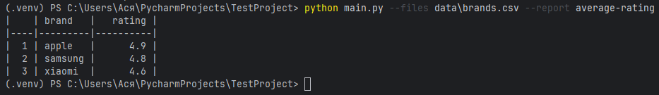

# Тестовое задание "Анализ рейтинга брендов"
## Выполнила: Ельпина Анастасия Дмитриевна

Скрипт для формирования отчёта по CSV-файлу с рейтингом брендов

### Входные данные

```csv
name,brand,price,rating
iphone 15 pro,apple,999,4.9
galaxy s23 ultra,samsung,1199,4.8
redmi note 12,xiaomi,199,4.6
```


Как создать новый отчет

Все отчёты находятся в файле reports.py.

Чтобы добавить новый отчёт:

1. В файле reports.py создать новую функцию.
Например, отчёт со средней ценой:
```
 def average_price_report(rows):
    sums = {}
    counts = {}

    for row in rows:
        brand = row["brand"]
        price = float(row["price"])
        sums[brand] = sums.get(brand, 0.0) + price
        counts[brand] = counts.get(brand, 0) + 1

    result = []
    for brand, total in sums.items():
        avg = total / counts[brand]
        result.append((brand, round(avg, 2)))

    headers = ["brand", "average_price"]
    table_rows = [[brand, avg] for brand, avg in result]
    return headers, table_rows
```
2. Cоздать новый отчёт в словаре REPORTS

```
REPORTS["average-price"] = average_price_report
```
3. Запустить в консоли

```
python main.py --files data/brands.csv --report average-price
```